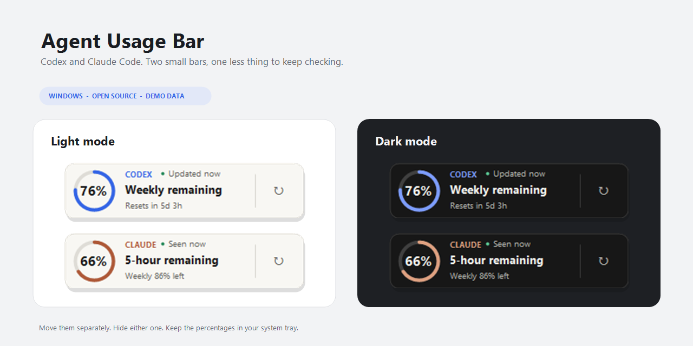
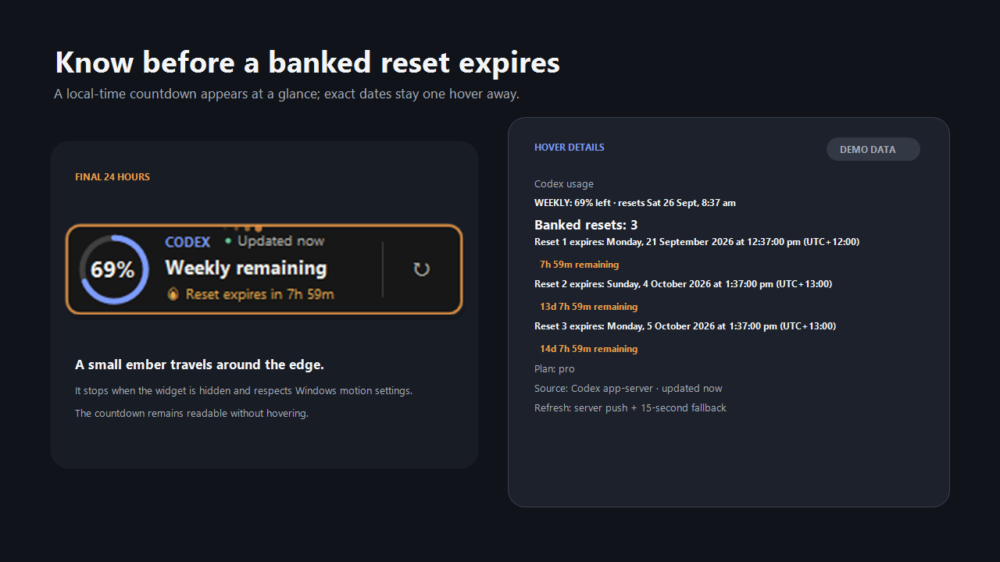
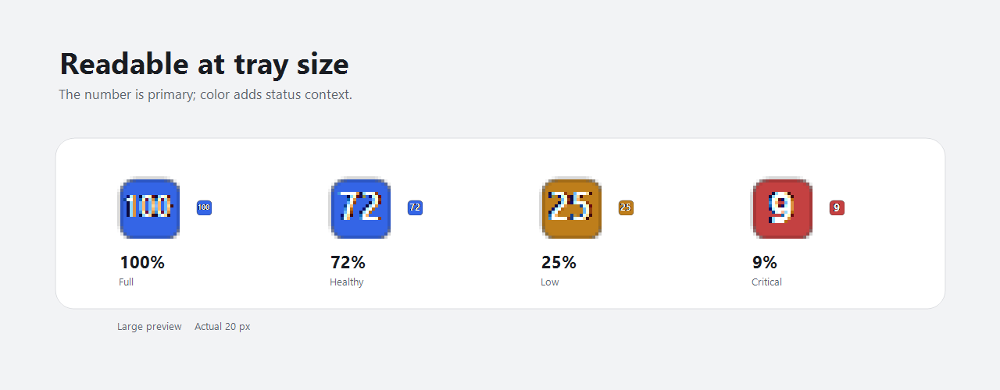
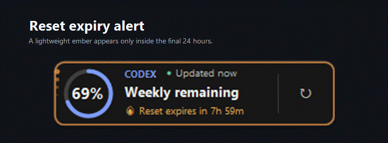

# Agent Usage Bar

Tiny Windows widgets for keeping an eye on Codex and Claude Code usage.

- Two separate bars. Move them wherever you like, or hide the one you don't use.
- Codex shows your weekly allowance. Claude shows five-hour and weekly limits.
- A ring and a big number show what's left. The percentage is in the tray too.
- Light and dark mode, saved separately for each bar.
- Hover for reset dates in your local time.
- Codex banked resets get a countdown and a little ember when expiry gets close.
- No extra login, API keys, analytics, or tracking from this app.



## Run it

This first public version is source-only. Read the code, then build it yourself.

1. Download this repository with **Code > Download ZIP** and extract it, or clone it with Git.
2. Open PowerShell in the folder, review `build.ps1`, then run:

   ```powershell
   powershell.exe -NoProfile -ExecutionPolicy Bypass -File .\build.ps1
   ```

3. Open `dist\AgentUsageBar.exe`.

Windows 10 or 11 and .NET Framework 4.8 are required. The build uses the compiler
included with Windows, with no package downloads or admin access.
`ExecutionPolicy Bypass` applies only to that PowerShell process. It does not
change your saved policy or override organization-enforced policies.

**Codex:** install and sign in to the official Codex desktop app, or use a CLI
installation exposing `codex.exe` on PATH. The bar connects automatically.
Five-hour Codex limits are hidden. Weekly usage and banked-reset details depend
on what Codex reports. The Codex integration has been used with a Pro account.

**Claude Code:** use a current Claude Code version with a Pro or Max subscription.
After building, connect its official status line:

```powershell
powershell.exe -NoProfile -ExecutionPolicy Bypass -File .\scripts\configure-claude.ps1
```

The setup backs up your settings and preserves an existing custom status line.
Use Claude Code normally; values appear after it reports subscription usage.
They update with Claude Code's status-line events. While Claude is idle or closed,
the bar shows the last reading and its age. It cannot fetch new values on its own.
API spend, context-window usage, and model-specific limits are not shown.
See [Claude setup](docs/claude-setup.md) for details and manual integration.

## Everyday controls

- Drag a bar to move it. Right-click for its theme, visibility, and other options.
- Hide either bar independently. Double-click its tray icon to show it again.
- F5 refreshes Codex or rereads Claude's local sample. Escape hides the focused bar.
- Start with Windows is optional and off by default. Quit closes both bars.

## Privacy, in plain English

Codex runs through your installed `app-server` and uses your existing sign-in to
read account metadata from OpenAI. Claude feeds the helper through its official
local status-line feature. The helper discards other session metadata and saves
only percentages, reset times, and the time of receipt.

The app makes no model requests, reads no credential files, and sends nothing to
the maintainer. It has no analytics or auto-updater. The official Codex and Claude
tools have their own network behavior and settings.

Preferences and the latest Claude sample stay in `%LOCALAPPDATA%\AgentUsageBar`.
There is no usage history or install tracking. Screenshots here use sample data.
See [security and trust details](SECURITY.md) for the full boundaries.

<details>
<summary>See Codex reset alerts and tray percentages</summary>







</details>

## Remove it

Turn off **Start with Windows**, if enabled. Disconnect the Claude status line:

```powershell
powershell.exe -NoProfile -ExecutionPolicy Bypass -File .\scripts\configure-claude.ps1 -Remove
```

Choose **Quit Agent Usage Bar**, then delete the downloaded folder. You can also
delete `%LOCALAPPDATA%\AgentUsageBar` to remove the local preferences and sample.
Your provider accounts and installations are unchanged.

## Contribute

Bug reports and small improvements are welcome. See [CONTRIBUTING.md](CONTRIBUTING.md).
Keep credentials, personal usage screenshots, and unredacted logs out of issues.
Report security issues [privately](SECURITY.md#report-a-security-issue).

MIT licensed. An independent community project, not affiliated with OpenAI or Anthropic.
